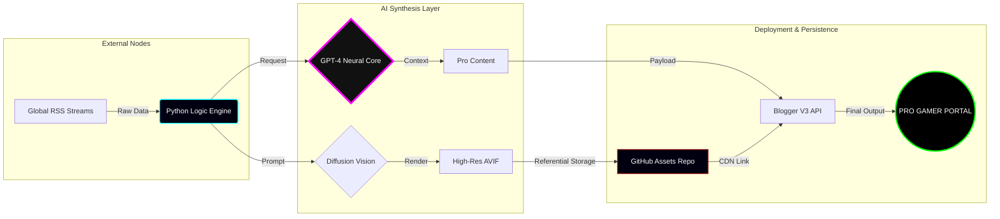

 

---

## 🏛️ النظام المعماري (System Architecture)

مشروع **Pro Gamer AR** هو منصة متطورة للأتمتة الصحفية (Automated Journalism Pipeline). النظام يعمل كمحرك معالجة عصبي يقوم بتحويل البيانات الخام من السحابة الرقمية إلى محتوى إبداعي وبصري فائق الجودة، مُحسّن برمجياً للتصدر في محركات البحث.

### 🧩 المكونات الحيوية (Core Modules)

| المكون (Module) | التوصيف البرمجي (Technical Specification) | القوة (Output) |
| :--- | :--- | :---: |
| **Data Scraper** | محرك رصد بروتوكولات RSS العالمية واستخراج المؤشرات الإخبارية اللحظية. | `READY` |
| **Neural Synthesis** | وحدة معالجة اللغات الطبيعية (NLP) لإعادة تخليق المحتوى بأسلوب حصري. | `ULTRA` |
| **Visual Genesis** | توليد الأصول البصرية بدقة 8K عبر محركات Flux لضمان التفرد الفني. | `8K RT` |
| **CDN Optimizer** | نظام إدارة الأصول الرقمية (Asset Management) باستخدام تقنيات AVIF لضغط البيانات. | `FAST` |

---

## 🧬 مخطط التدفق البياني (Data Flow Map)

🛠️ لغات البرمجة والتقنيات (Tech Stack)

📊 مؤشرات الأداء (Live Analytics)

🛡️ سياسة الاستخدام والامتثال (Compliance)

[!NOTE]

تكامل منصة النشر (Publishing Integration): يعمل هذا النظام كمحرك خلفي (Backend) لتغذية منصات النشر الرقمية (مثل Blogger). تُستخدم الأصول الموجودة في /images كمرجع بصري أساسي للمقالات المنشورة، حيث يتم استدعاؤها عبر واجهات برمجة التطبيقات لضمان استقرار العرض وسرعة التحميل عالمياً.

<b>PRO GAMER AR | POWERED BY FA511DH 2026 </b>

